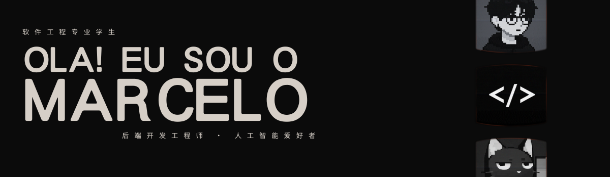
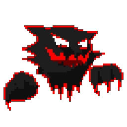

  

  
  
  
  
  

  

<h3 align="center">Quem Sou Eu?</h3>

Sou estudante de `Engenharia de Software` no `Centro Universitário de Goiás` (UniGoiás). Minha jornada começou pela curiosidade de entender como sites funcionam — aprendi `HTML, CSS e JavaScript` com o Gustavo Guanabara e fui me aprofundando até me apaixonar por `backend, dados e IA`. Meus primeiros projetos surgiram no primeiro período: um `sistema de lançamento de notas em C` e um `modelo LLM em Python para prever valores do milho` — simples, mas que definiram meu caminho.

Hoje consolido minha base em `fullstack` desenvolvendo um sistema de agendamentos para barbearias com `Java, Spring Boot, PostgreSQL e React`, enquanto miro minha especialização em `Engenharia de Dados e Machine Learning`. Gosto de trabalhar em equipe no estilo `Kanban` e costumo assumir o papel de `gestor dos projetos em grupo` — um perfil de `liderança` que faz parte de quem `eu sou`.

 

   
<h3 align="center"> 
   
  Um Pouco Mais Sobre Mim
</h3> 

⬛ Gosto muito de música e curto bastante Rock, MPB e Neo-Soul 
⬜ Atualmente explorando filosofia como hobby 
⬛ Fã de jogos e séries — especialmente Game of Thrones e Brooklyn 99 
⬜ Sempre buscando aprender algo novo e aplicar na prática 
⬛ Gosto de fotografia e cinema 

  
  

  

  
  

